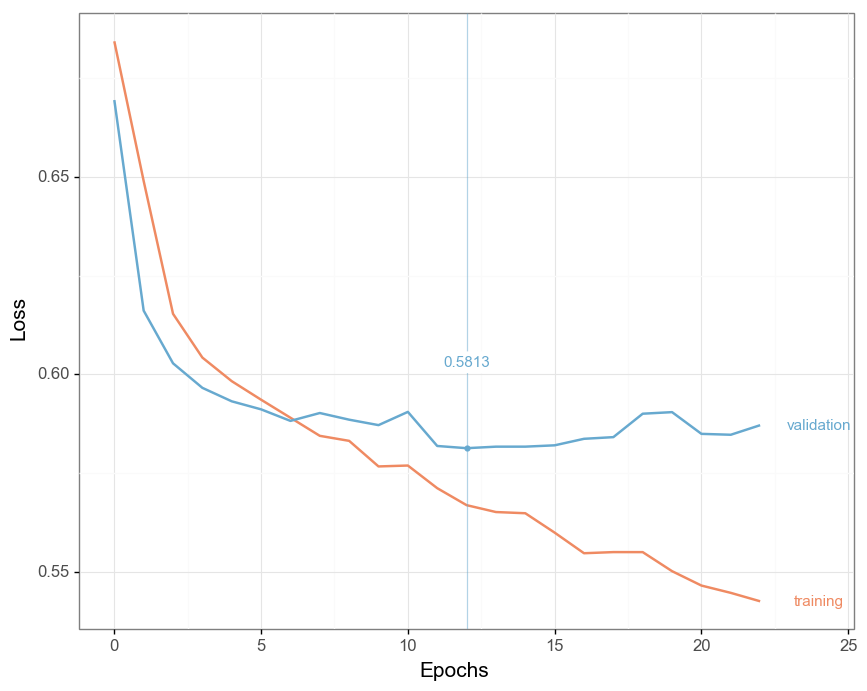

# Deep Plots [](https://travis-ci.com/jfilter/deep-plots) [](https://pypi.org/project/deep-plots/) [](https://pypi.org/project/deep-plots/)

Visualize Your Deep Learning Training in Static Graphics.

<div align="center">
  
</div>

**Why?** [Analyzing learning curves](https://www.coursera.org/lecture/machine-learning/learning-curves-Kont7) are a standard way to evaluate the learning performances of machine learning models. There exist [several tools](#Related) for creating live plots. This Python package focuses on producing beautiful static graphics only.

Currently, only plotting from [Keras CSV log file](https://keras.io/callbacks/#csvlogger) format is supported.

For creating the graphics, [plotnine](https://github.com/has2k1/plotnine) is used which is build upon [Matplotlib](https://matplotlib.org/).

## Installation

```bash
pip install deep_plots
```

Unfortunately, you may need to:

```bash
pip install numpy
```

before because a [depedency implicitly assumes numpy is installed](https://github.com/statsmodels/statsmodels/issues/3207).

## Usage

```python
# create a Keras callback to log your training
csv_logger = keras.callbacks.CSVLogger('log.csv')

# train your model
model.fit(X, y, ..., callbacks=[csv_logger, ...])

# after finishing training, plot the learning curves with Deep Plots
deep_plots.from_keras_log('log.csv', 'output_dir')
```

## Related

-   [TensorBoard](https://github.com/tensorflow/tensorboard): Live plots for TensorFlow, [Keras](https://keras.io/callbacks/#tensorboard).
-   [tensorboardX](https://github.com/lanpa/tensorboardX): Live plots for PyTorch, Chainer etc..
-   [Live Loss Plot](https://github.com/stared/livelossplot): Live plots in Jupyter Notebooks for Keras, PyTorch etc..

## Contributing

If you have a **question**, found a **bug** or want to propose a new **feature**, have a look at the [issues page](https://github.com/jfilter/deep-plots/issues).

**Pull requests** are especially welcomed when they fix bugs or improve the code quality.

## License

MIT.
